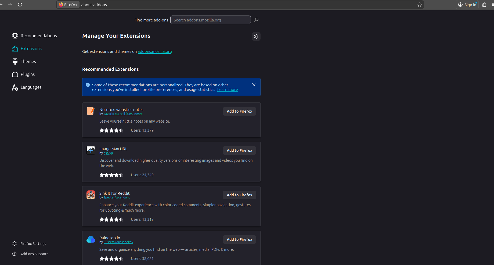
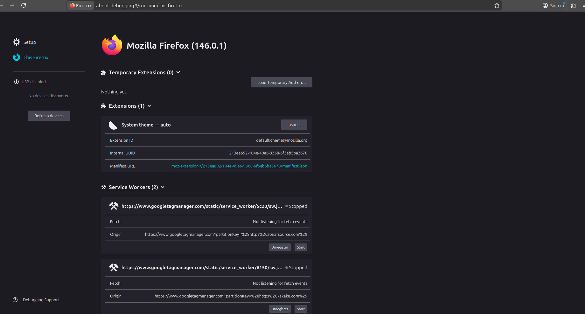
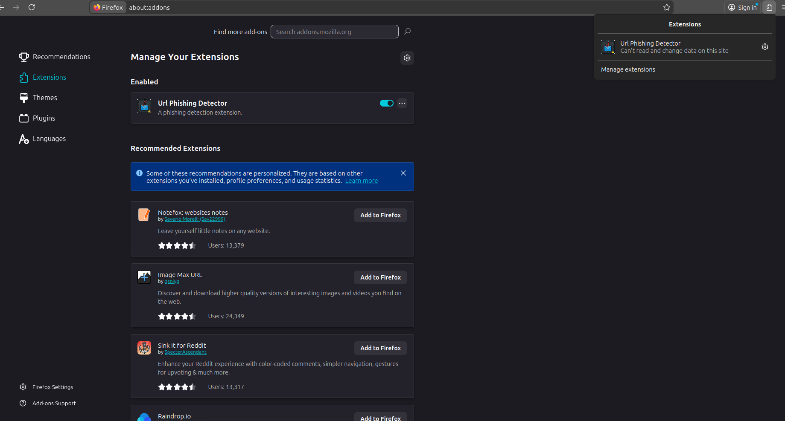
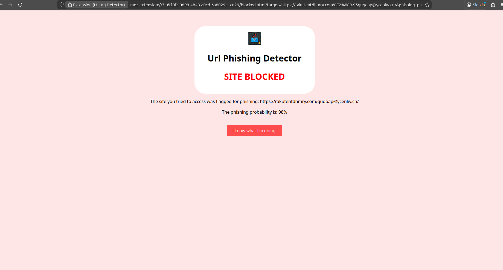

# Final Project for the class of Aprendizagem Aplicada à Segurança 2025/2026

The main objective of this work is to develop an application that applies the topics discussed in the course within the domain of privacy and security. Our group decided to choose the topic **Phishing URL Detection**: Create a lightweight classifier that detects phishing attempts based solely on the lexical features of a URL (e.g., URL length, entropy, special characters) without downloading the page content.

This repository contains all the source code, data processing scripts, trained models, and documentation related to the project.

## Quick Start

To run the application, it is required to have Python 3.12 installed along with the packages listed in `requirements.txt` and some data files that are available in this [Google Drive Folder](https://drive.google.com/drive/folders/1xrPei5DFb7oncDKSkC_L2vxUFvsauM2I?usp=sharing).

```bash
crawlee==1.2.1
Flask==3.1.2
matplotlib==3.10.8
numpy==2.4.0
polars==1.36.1
pydantic==2.12.5
requests==2.32.5
scikit-learn==1.8.0
seaborn==0.13.2
tqdm==4.67.1
```

You must store them in the `data/` folder, however don't include the model files (the ones that end with `.pkl`) in this folder, include them in the `models/` folder.

If you have `uv` installed you can simply run:

```bash
uv run main.py
```

And it will automatically install all the required dependencies and start the main application. If you don't have `uv` installed, you can install it using the following command:

```bash
curl -LsSf https://astral.sh/uv/install.sh | sh
```

Alternatively, you can manually install the required packages using pip and run the main application:

```bash
python -m venv venv
source venv/bin/activate
pip install -r requirements.txt
python main.py
```

You can include all the files downloaded that are in the Shared Drive, however the `benign.json` and `spam.json` are not mandatory, you can create them by executing the `main.py` file. It is required for you to include the files `majestic_million.csv`, `non_spam_urls.txt` and `online-valid.json` in the `data/` folder for the application to work properly. The `non_spam_urls_filtered.txt` is also mandatory, but you can create it executing the following command:

```bash
# Using uv
uv run scripts/filter_non_spam_by_majestic.py
# With this command you need create a venv and have the requirements installed
python3 scripts/filter_non_spam_by_majestic.py
```

If you don't have the `benign.json` and `spam.json` files, then the first lines of th output will be different. The purpose of the main application is to train and evaluate a Phishing URL Detection Model. Has you can see in the output abover, after loading the dataset, you will be prompted to choose the algorithm you want to use to train the model. You can choose between Random Forest, K-Nearest Neighbors (KNN) or both to train and obtain data about both models.

We also created a script that allows you to perform web scraping to obtain more phishing URLs using the Crawlee library. You can run it using the following command:

```bash
sudo chmod +x crawler.sh
./crawler.sh
```

However this script executes for a long period of time so we advise you to run only if you obtain more data.

We also created a script to create some visualizations about the data collected and the model performance. You can run it using the following command:

```bash
# Using uv
uv run visualizations.py
# With this command you need create a venv and have the requirements installed
python3 visualizations.py
```

This script will generate some plots and save them in the `visualizations/` folder.

Finally we developed a browser extension that uses the trained model to detect phishing URLs in real-time. To load the extension, you must have the browser **FireFox** installed and follow these steps:

1. Execute the flask application by running
```bash
uv run -- flask run -p 3000 
# Or
python -m flask run -p 3000
```

2. Open FireFox and navigate to `about:addons`.


3. Click on the gear icon and select "Debug Add-ons".
4. Click on "Load Temporary Add-on".


5. Select the `manifest.json` file located in the `browser_extension/` folder of this repository.
6. The extension should now be loaded and active in your browser.
7. You can click on the extension icon or pin it to the toolbar to better access its features.


8. To test the extension, you can visit known phishing websites or use test URLs to see if the extension correctly identifies them.


## Dataset

For this project, we utilized for Phishing URLs two datasets:

- One from [PhishTank](https://www.phishtank.com/) which is a community-based phishing verification system that provides a large database of reported phishing URLs, we found this [Repository](https://github.com/ProKn1fe/phishtank-database/tree/master) that contains the PhishTank data updated in JSON format
- Another dataset we found but only used the Phishing URLs from it was **PhiUSIIL Phishing URL Dataset** which is available in [Kaggle](https://www.kaggle.com/datasets/ndarvind/phiusiil-phishing-url-dataset?resource=download)

For Legitimate URLs we developed a web crawler using the Crawlee library to scrape legitimate URLs from various sources. Additionally, we used the **Majestic Million** dataset to filter out any potential phishing URLs from our legitimate URL list. The Majestic Million dataset provides a list of the top one million websites based on their backlink profiles, which we used as a reference for legitimate URLs, and can be found [here](https://majestic.com/reports/majestic-million).

## Major Results

The following table summarizes the performance of our best model, Random Forest on the test set (15% split).

| Class | Precision | Recall | F1-Score | Support |
| :--- | :---: | :---: | :---: | :---: |
| **Legitimate** | 0.99 | 0.99 | 0.99 | 99537 |
| **Phishing** | 0.95 | 0.94 | 0.95 | 24519 |
| **Accuracy** | | | **0.98** | 124056 |

Confusion Matrix:

|         | Predicted Legitimate | Predicted Phishing |
|---------|----------------------|--------------------|
| Actual Legitimate |        86760         |        1067        |
| Actual Phishing   |        1265          |       20369        |

True Negatives: 86760, False Positives: 1067
False Negatives: 1265, True Positives: 20369

We also trained and evaluated the K-Nearest Neighbors (KNN) model, and obtained the following results:

| Class | Precision | Recall | F1-Score | Support |
| :--- | :---: | :---: | :---: | :---: |
| **Legitimate** | 0.98 | 0.99 | 0.99 | 99537 |
| **Phishing** | 0.96 | 0.92 | 0.94 | 24519 |
| **Accuracy** | | | **0.98** | 124056 |

Confusion Matrix:
|         | Predicted Legitimate | Predicted Phishing |
|---------|----------------------|--------------------|
| Actual Legitimate |        87078         |        749        |
| Actual Phishing   |        1773          |       19861       |

True Negatives: 87078, False Positives: 749
False Negatives: 1773, True Positives: 19861

### Key Findings:

We selected Random Forest as the final best solution because it blocked more phishing URLs than KNN. Although KNN produced fewer false alarms on legitimate websites, Random Forest was a better choice for security, since missing a phishing attack is worse than incorrectly flagging a legitimate page.

## Authors

- [José Gameiro](https://github.com/zegameiro)
- [Tomás Victal](https://github.com/fungame2270)

## License

This project is licensed under the MIT License - see the [LICENSE](LICENSE) file for details.